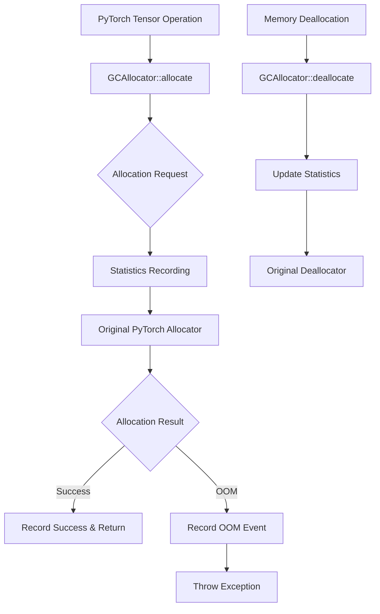

# gcAllocator - Graceful CUDA Allocator for PyTorch

A custom GPU memory allocator for PyTorch that handles out-of-memory (OOM) conditions gracefully through intelligent retry mechanisms and inter-process coordination.

## Phase 1 - Core Infrastructure (Current)

This initial phase establishes the foundation for graceful OOM handling by implementing a custom allocator that intercepts PyTorch's CUDA memory allocation requests.

### Features (Phase 1)

-  Custom CUDA allocator that integrates with PyTorch
-  Transparent pass-through to original PyTorch allocator
-  Comprehensive allocation statistics tracking
-  Per-device memory usage monitoring
-  OOM event detection and counting
-  Optional detailed logging of allocation events
-  Python and C++ interfaces

### Architecture



### Installation

#### Prerequisites

- PyTorch >= 1.9.0 with CUDA support
- CUDA Toolkit (matching PyTorch's CUDA version)
- C++ compiler with C++17 support
- Python >= 3.7

#### Building from Source

```bash
# Clone the repository
git clone https://github.com/your-org/gcAllocator.git
cd gcAllocator

# Build and install
pip install -e .

# Or for development with debug symbols
DEBUG_BUILD=1 pip install -e .
```

### Usage

#### Basic Usage

```python
import torch
import gcAllocator

# Install the allocator globally
gcAllocator.install(enable_logging=True)

# Now all PyTorch CUDA allocations go through gcAllocator
tensor = torch.randn(1000, 1000, device='cuda')

# Get allocation statistics
stats = gcAllocator.get_stats()
print(stats)

# Uninstall when done
gcAllocator.uninstall()
```

#### Context Manager

```python
import torch
from gcAllocator import GCAllocator

# Use as a context manager for automatic cleanup
with GCAllocator(enable_logging=True) as allocator:
    tensor = torch.randn(5000, 5000, device='cuda')
    stats = allocator.get_stats()
    print(f"Peak memory: {stats.peak_bytes_allocated / 1024**3:.2f} GB")
```

#### Environment Variables

- `GC_ALLOCATOR_LOG=1` - Enable detailed logging of allocation events

### Testing

Run the test suite:

```bash
# Run all tests
pytest tests/

# Run with verbose output
pytest tests/ -v -s

# Run specific test file
python tests/test_basic_allocation.py
```

### Project Structure

```
gcAllocator/
├── gcAllocator/
│   ├── __init__.py           # Python interface
│   └── csrc/
│       ├── gc_allocator_core.h     # Main allocator header
│       ├── gc_allocator_core.cpp   # Main allocator implementation
│       ├── allocator_stats.h       # Statistics tracking
│       ├── allocator_stats.cpp     # Statistics implementation
│       └── python_bindings.cpp     # Python bindings
├── tests/
│   ├── test_basic_allocation.py    # Basic functionality tests
│   └── cpp/
│       └── test_allocator_core.cpp # C++ unit tests
├── setup.py                         # Build configuration
├── README.md                        # This file
└── .gitignore                      # Git ignore rules
```

### Current Limitations (Phase 1)

- No retry mechanism yet (coming in Phase 2)
- OOM errors still cause immediate failure (Phase 2 will add graceful handling)
- No inter-process coordination (Phase 5)
- Synchronous allocation only (Phase 4 will add async support)

### Upcoming Phases

- **Phase 2**: Retry mechanism with exponential backoff
- **Phase 3**: Enhanced Python bindings and configuration
- **Phase 4**: Asynchronous allocation support
- **Phase 5**: Inter-process memory pressure protocol
- **Phase 6**: Checkpointing and advanced features
- **Phase 7**: Production hardening

### Performance

Phase 1 introduces minimal overhead (<1%) during normal operation since it primarily passes through to the original allocator while collecting statistics.

### License

MIT License - See LICENSE file for details

### Contributing

Contributions are welcome! Please see CONTRIBUTING.md for guidelines.
```
